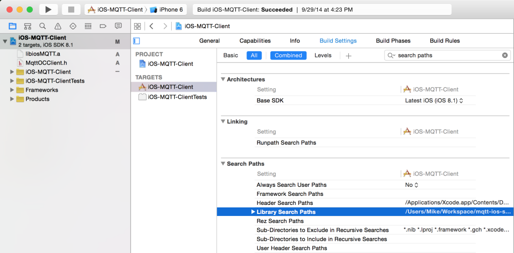

mqtt-ios-sample
===============
MQTT iOS Sample is an application that provides a user the ability to publish and subscribe to MQTT topics from their iOS device.

This project depends on the iOS MQTT Client library included in the [IBM WebSphere Mobile Messaging and M2M Client Pack](https://www.ibm.com/developerworks/community/blogs/c565c720-fe84-4f63-873f-607d87787327/entry/download?lang=en). 
Setup
-----
After downloading the client pack from the link above, unzip it and go to `SDK/clients/iOS/` and copy `libiosMQTT.a` and `MqttOCClient.h` into your XCode project. 

Once the files have been added to the project, ensure that they are included in the `Library Search Paths` and `Header Search Paths` properties of the project. These properties can be found by selecting the project in XCode and going to `Build Settings`.

Connect
-------
The connect view specifies the connection options for connecting to the MQTT broker. The options include server, port, and CleanSession.

Publish
-------
The publish view allows the user to send an MQTT message to a specified topic. The Quality of Service (QoS) and Retained flag can also be set on the message.

Subscribe
---------
The subscribe view allows the user to subscribe to a specified MQTT topic filter. The QoS can also be set for the subscription.

Log
---
The log view displays information messages about the application. These messages include connecting and disconnecting, publishing, subscribing, and receiving messages.

If you have any comments or suggestions for improvements, please create an Issue or better yet submit a Pull Request. If you do submit a Pull Request please indicate in the Pull Request that you accept and agree to be bound by the terms of the IBM Contributor License Agreement that can be found in the CLA.md file in the repository.
